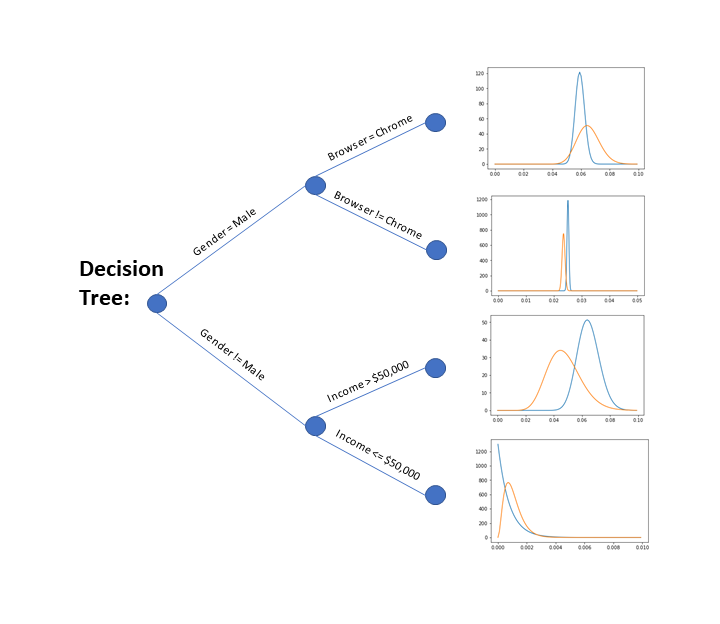

# Contextual Bandits Decision Tree

This repo houses a python implementation of the decision tree designed by
Feraud, R. , Allesarido, R. , Urvoy, T. & Clerot, F.
Random Forest for the Contextual Bandit Problem
https://arxiv.org/pdf/1504.06952.pdf

The orignal version was only designed for use with binary variables.
Additions have been made to allow for continuous and categorical variables,
and a statistical test has been added to each feature-value split to ensure only statistically significant results are used.

## Acknowledgments
The decision tree python code structure was heavily inspired by the following sources:

* https://lethalbrains.com/learn-ml-algorithms-by-coding-decision-trees-439ac503c9a4
* https://medium.com/@curiousily/building-a-decision-tree-from-scratch-in-python-machine-learning-from-scratch-part-ii-6e2e56265b19
* https://towardsdatascience.com/random-forests-and-decision-trees-from-scratch-in-python-3e4fa5ae4249
* https://machinelearningmastery.com/implement-decision-tree-algorithm-scratch-python/
